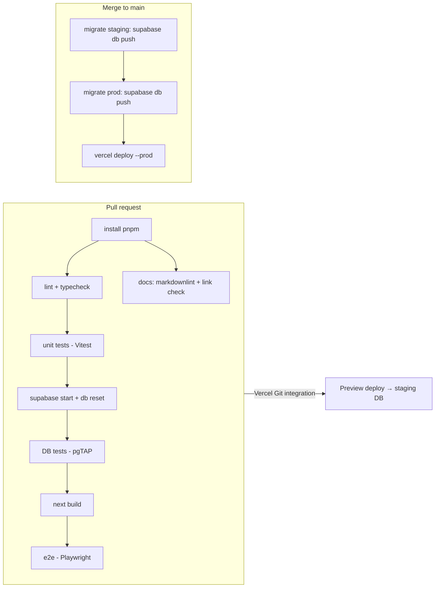

# CI/CD

Everything runs on free tiers: GitHub Actions, Vercel Hobby (Git integration), and two Supabase Free projects.

## Environments

| Env | Frontend | Database | Trigger |
|---|---|---|---|
| Local | `pnpm dev` | Supabase CLI in Docker (`supabase start`) | — |
| CI | Next.js build in the Actions runner | Supabase CLI in Docker | every PR / push |
| Preview / staging | Vercel Preview URL per PR | Supabase project **`uc-attendance-staging`** | PR opened or updated |
| Production | Vercel Production | Supabase project **`uc-attendance-prod`** | merge to `main` |

The Supabase Free plan allows 2 active projects, so staging and production use both slots.

## Pipelines

### Workflows (`.github/workflows/`)

| File | Trigger | Jobs |
|---|---|---|
| `ci.yml` | `pull_request`, `push` to `main` | `quality` (lint, typecheck, unit, i18n key check), `db` (supabase start, db reset, pgTAP), `e2e` (build + Playwright against local Supabase), `docs` (markdownlint, lychee) |
| `deploy.yml` | `ci.yml` succeeded on `main` (`workflow_run`), or manual | `migrate staging` → `migrate production` → `deploy production` (`vercel pull` → `vercel build --prod` → `vercel deploy --prebuilt --prod`, then a smoke test of `/api/health`). The production jobs run in the GitHub Environment `production`. Migrations run through [`scripts/ci/supabase-db.sh`](../../scripts/ci/supabase-db.sh) `push`. |
| `keepalive.yml` | Mondays 12:17 UTC + manual | For staging and prod: `supabase migration list` (via `supabase-db.sh ping`), a real DB query so the free projects don't pause. Also runs `curl` on prod `/api/health` (`vars.PRODUCTION_URL`). |
| Dependabot | weekly | npm and GitHub Actions updates |

**Production deploys are gated on migrations.** Vercel's automatic production deploy from Git is turned **off** (`git.deploymentEnabled.main = false` in `vercel.json`). Production deploys only through `deploy.yml`, after the migrations succeed. Preview deploys stay automatic (Vercel Git integration, Preview env vars = staging).

The deploy workflow pins the Vercel CLI version (`VERCEL_CLI` in `deploy.yml`). Bump it deliberately, because Dependabot doesn't update `pnpm dlx` versions.

Migrations must be **backward compatible** (expand → deploy → contract), because the old frontend runs briefly against the new schema.

## Scheduled jobs

| Job | Where | Schedule |
|---|---|---|
| Auto-close forgotten sessions | Vercel Cron → `/api/cron/auto-close` | daily `0 7 * * *` UTC (= 04:00 BRT, UTC−3). Added to `vercel.json` together with the route in milestone 8 (spec 006), so the cron never calls a missing endpoint. |
| Supabase keep-alive | GitHub Actions `keepalive.yml` | weekly (Mondays) |

Vercel Hobby allows cron jobs at most once per day, which is all we need. Hobby cron timing is only accurate to the hour (it may fire 07:00–07:59 UTC), so `close_stale_sessions()` always uses the fixed 04:00 cutoff instant and only closes sessions that started before it.

## Branching and protection

- Trunk-based: short-lived branches, then a PR into `main`.
- `main` is protected: the `quality`, `db`, `e2e` and `docs` checks are required and branches must be up to date. Required reviews are 0 while there is a single maintainer; raise it to 1 when another maintainer joins. Force pushes and deletion are blocked.
- The repo allows **squash merge only** and deletes branches after merge.
- Conventional Commits in PR titles (squash merge).

## Secrets and variables

| Name | Scope | Notes |
|---|---|---|
| `SUPABASE_PROJECT_REF_STAGING`, `SUPABASE_PROJECT_REF_PROD` | GitHub secret | Project refs (not sensitive, but kept next to the passwords) |
| `SUPABASE_DB_PASSWORD_STAGING`, `SUPABASE_DB_PASSWORD_PROD` | GitHub secret | The only credential CI needs for the database |
| `SUPABASE_POOLER_HOST` | GitHub **variable** | `aws-1-sa-east-1.pooler.supabase.com` (Session pooler, port 5432). GitHub runners have no IPv6, so they can't use the direct `db.<ref>.supabase.co` host. |
| `VERCEL_TOKEN` | GitHub secret | Scoped to the **Under Control** Vercel team. Expires yearly. |
| `VERCEL_ORG_ID`, `VERCEL_PROJECT_ID` | GitHub secret | The **Team ID** (`team_…`, not a user ID) and the Project ID (`prj_…`) |
| `PRODUCTION_URL` | GitHub **variable** | Used by the keep-alive health check |
| `NEXT_PUBLIC_SUPABASE_URL` | Vercel, type Config (Preview = staging, Production = prod) | The base URL only (`https://<ref>.supabase.co`), with no `/rest/v1` |
| `NEXT_PUBLIC_SUPABASE_PUBLISHABLE_KEY` | Vercel, type Config | `sb_publishable_…`; public by design, protected by RLS |
| `SUPABASE_SECRET_KEY` | Vercel, type **Secret** | `sb_secret_…`; maps to the `service_role` Postgres role; server only |
| `KIOSK_TOKEN`, `CRON_SECRET` | Vercel, type **Secret** | Different values per environment |

**No Supabase access token.** CI talks to Postgres directly with `--db-url` (pooler + DB password) instead of `supabase link`. `link` needs the token to read the project's API keys, including the secret key that bypasses RLS, which would make the CI token far more powerful than migrations require.

## Release and rollback

- **Frontend rollback:** "Promote" a previous deployment in the Vercel dashboard (instant).
- **DB rollback:** write a new forward migration that reverts the change. Never edit an applied migration.
- **Backups:** Supabase Free has no downloadable backups or point-in-time recovery. The repo is **public**, so plain `pg_dump` artifacts are **not allowed**: anyone with a GitHub account could download members' names and emails. The planned approach (spec 007, AC9) is a weekly dump **encrypted with [age](https://age-encryption.org)** to a public key stored as a repo variable. The private key lives only in the team password manager.
