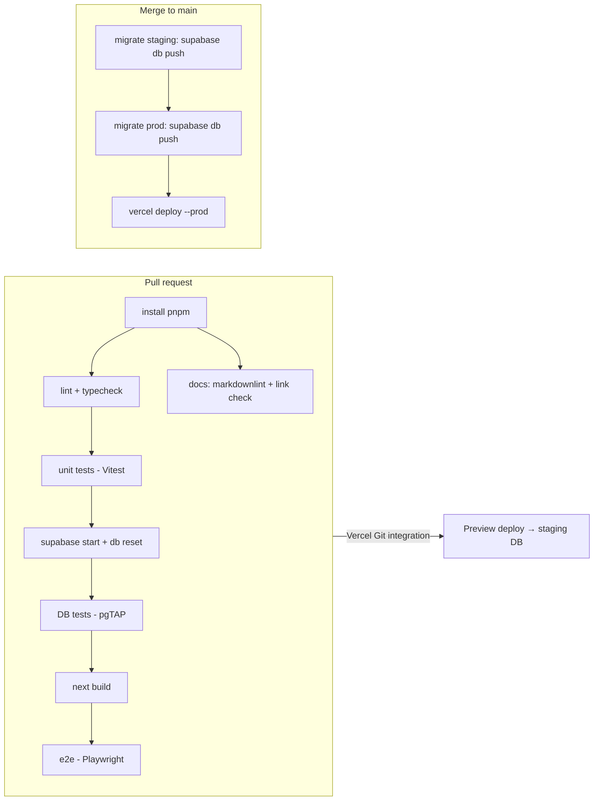

# CI/CD

Everything runs on free tiers: GitHub Actions, Vercel Hobby (Git integration), and two Supabase Free projects.

## Environments

| Env | Frontend | Database | Trigger |
|---|---|---|---|
| Local | `pnpm dev` | Supabase CLI in Docker (`supabase start`) | — |
| CI | Next.js build in the Actions runner | Supabase CLI in Docker | every PR / push |
| Preview / staging | Vercel Preview URL per PR | Supabase project **`uc-attendance-staging`** | PR opened or updated |
| Production | Vercel Production | Supabase project **`uc-attendance-prod`** | merge to `main` |

The Supabase Free plan allows 2 active projects, so staging and production use both slots.

## Pipelines

### Workflows (`.github/workflows/`)

| File | Trigger | Jobs |
|---|---|---|
| `ci.yml` | `pull_request`, `push` to `main` | `quality` (lint, typecheck, unit, i18n key check), `db` (supabase start, db reset, pgTAP), `e2e` (build + Playwright against local Supabase), `docs` (markdownlint, lychee) |
| `deploy.yml` | `push` to `main` once `ci.yml` passes (`workflow_run`) | `migrate-staging` → `migrate-prod` (GitHub Environment `production`) → `deploy-prod` (`vercel deploy --prod`) |
| `keepalive.yml` | `schedule: weekly` + manual | `curl` prod and staging `/api/health` so Supabase doesn't pause |
| Dependabot | weekly | npm and GitHub Actions updates |

**Production deploys are gated on migrations.** Vercel's automatic production deploy from Git is turned **off** (`git.deploymentEnabled.main = false` in `vercel.json`). Production deploys only through `deploy.yml`, after the migrations succeed. Preview deploys stay automatic.

Migrations must be **backward compatible** (expand → deploy → contract), because the old frontend runs briefly against the new schema.

## Scheduled jobs

| Job | Where | Schedule |
|---|---|---|
| Auto-close forgotten sessions | Vercel Cron → `/api/cron/auto-close` | daily `0 7 * * *` UTC (= 04:00 BRT, UTC−3) |
| Supabase keep-alive | GitHub Actions `keepalive.yml` | weekly |

Vercel Hobby allows cron jobs at most once per day, which is all we need. Hobby cron timing is only accurate to the hour (it may fire 07:00–07:59 UTC), so `close_stale_sessions()` always uses the fixed 04:00 cutoff instant and only closes sessions that started before it.

## Branching and protection

- Trunk-based: short-lived branches, then a PR into `main`.
- `main` is protected: the `quality`, `db`, `e2e` and `docs` checks are required, plus 1 review (when another maintainer is available), and history stays linear.
- Conventional Commits in PR titles (squash merge).

## Secrets and variables

| Name | Scope | Notes |
|---|---|---|
| `SUPABASE_ACCESS_TOKEN` | GitHub | Personal access token for the Supabase CLI |
| `SUPABASE_PROJECT_REF_STAGING`, `SUPABASE_PROJECT_REF_PROD` | GitHub | Project refs |
| `SUPABASE_DB_PASSWORD_STAGING`, `SUPABASE_DB_PASSWORD_PROD` | GitHub | For `supabase db push` |
| `VERCEL_TOKEN`, `VERCEL_ORG_ID`, `VERCEL_PROJECT_ID` | GitHub | For `vercel deploy --prod` |
| `NEXT_PUBLIC_SUPABASE_URL`, `NEXT_PUBLIC_SUPABASE_ANON_KEY` | Vercel (Preview = staging, Production = prod) | |
| `SUPABASE_SERVICE_ROLE_KEY` | Vercel (server) | |
| `KIOSK_TOKEN`, `CRON_SECRET` | Vercel | |

## Release and rollback

- **Frontend rollback:** "Promote" a previous deployment in the Vercel dashboard (instant).
- **DB rollback:** write a new forward migration that reverts the change. Never edit an applied migration.
- **Backups:** Supabase Free has no point-in-time recovery, so a weekly `pg_dump` runs from `keepalive.yml` and is stored as a 90-day Actions artifact. (Data is small; tracked as an optional task in spec 007.)
