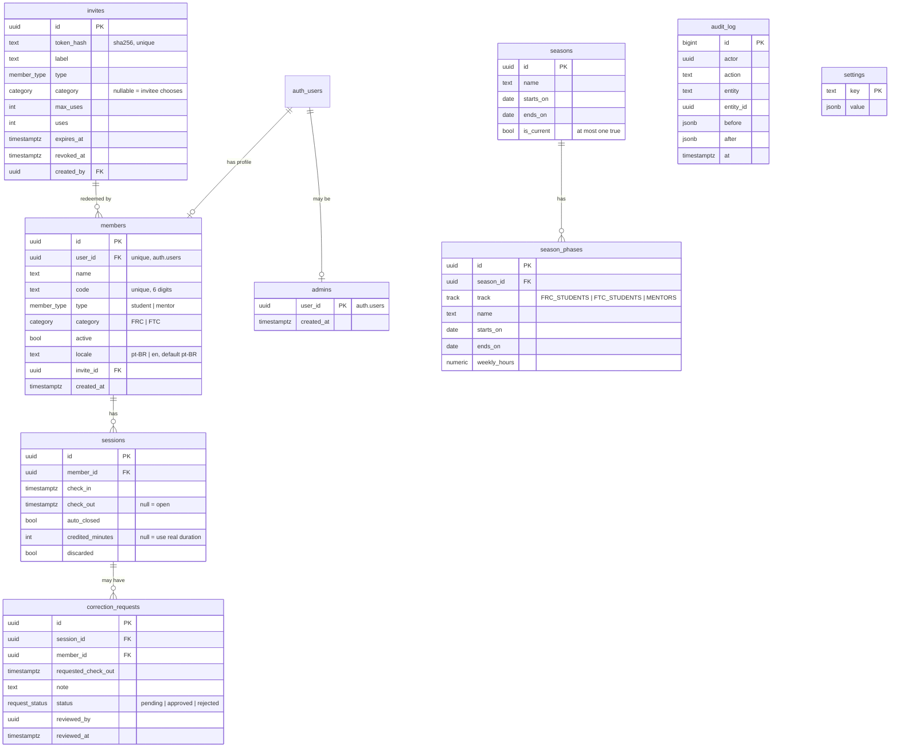

# Data model

All tables live in the `public` schema of Supabase Postgres. Schema changes happen **only** through migrations in `supabase/migrations/`.

## ER diagram

## Enums

| Enum | Values |
|---|---|
| `member_type` | `student`, `mentor` |
| `category` | `FRC`, `FTC` |
| `track` | `FRC_STUDENTS`, `FTC_STUDENTS`, `MENTORS` |
| `request_status` | `pending`, `approved`, `rejected` |

`members.locale` is `text` with a `check (locale in ('pt-BR','en'))`, extended by migration when a language is added. It's text rather than an enum, so adding a language is cheap.

## Constraints and indexes

- `members.code`: `unique`, `check (code ~ '^[0-9]{6}$')`.
- `members.user_id`: `unique`. One member profile per auth user.
- `sessions`: a partial unique index `on (member_id) where check_out is null` gives **one open session per member**.
- `sessions`: `check (check_out is null or check_out > check_in)`.
- `seasons`: a partial unique index `on ((true)) where is_current` gives **at most one current season**.
- `season_phases`: `check (ends_on >= starts_on)`, `check (weekly_hours >= 0)`, and an exclusion constraint (`btree_gist`) `exclude using gist (season_id with =, track with =, daterange(starts_on, ends_on, '[]') with &&)`, so there are **no overlaps per track**. A trigger checks that the phase lies inside the season.
- `invites.token_hash`: `unique`.
- Index `sessions (member_id, check_in)`.

## Derived values

- `member_track(m)`: `case when m.type = 'mentor' then 'MENTORS' when m.category = 'FRC' then 'FRC_STUDENTS' else 'FTC_STUDENTS' end`.
- `session_minutes(s, from, to)`: the minutes credited inside a window. See [attendance-math.md](attendance-math.md).

## SQL functions (RPC)

| Function | Security | Caller | Purpose |
|---|---|---|---|
| `is_admin()` | definer, stable | RLS policies | `exists (select 1 from admins where user_id = auth.uid())` |
| `invite_preview(token)` | definer | anon/authenticated | Returns validity, type and fixed category. Never returns other data. |
| `redeem_invite(token, name, category, code)` | definer | authenticated (no member yet) | Validates and creates the member atomically. |
| `kiosk_toggle(code)` | definer | service role only | Opens or closes a session. Returns `{action, name, locale, minutes}` so the kiosk greets the member in their language. |
| `kiosk_checkout(member_id)` | definer | service role only | Closes an open session. |
| `kiosk_present()` | definer | service role only | Lists open sessions: names and check-in times only. |
| `close_stale_sessions()` | definer | service role only (cron) | Auto-closes open sessions (see ADR 0003). |
| `expected_minutes(season_id, track, at)` | invoker, stable | any | Expected minutes to date. |
| `ranking(season_id, track, at)` | definer | admin (checks `is_admin()`) | The full ranking. |
| `my_stats(season_id)` | definer | member | The caller's stats plus their position in their track. |
| `request_correction(session_id, check_out, note)` | definer | member | Only on the member's own auto-closed session. |
| `review_correction(id, approve)` | definer | admin | Applies or rejects, and writes the audit log. |

`execute` on service-role-only functions is revoked from `anon` and `authenticated`.

## RLS policy matrix

| Table | anon | member (authenticated) | admin |
|---|---|---|---|
| `members` | — | select / update own row (only `name`, `code`, `locale`, via column grants) | all |
| `admins` | — | select own row | all |
| `invites` | — | — | all |
| `sessions` | — | select own | all |
| `correction_requests` | — | select own, insert via RPC | all |
| `seasons`, `season_phases` | — | select | all |
| `audit_log` | — | — | select |
| `settings` | — | select | all |

Kiosk and cron access bypasses RLS through the service role, but **only** by calling the specific SQL functions above. The service client is never exposed to the browser.

## Settings (key/value)

| Key | Default | Meaning |
|---|---|---|
| `auto_close_time` | `"04:00"` | Local time the daily auto-close runs; must match the Vercel Cron schedule |
| `color_thresholds` | `{"green":100,"yellow":75}` | Dashboard % bands |
| `timezone` | `"America/Sao_Paulo"` | Business timezone |
| `default_locale` | `"pt-BR"` | Fallback UI language |
