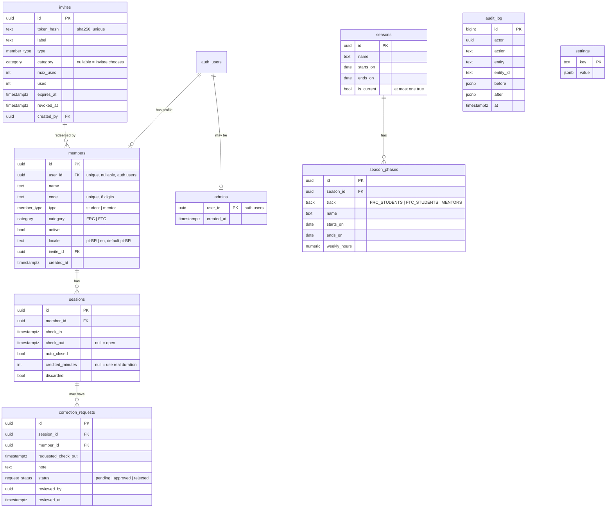

# Data model

All tables live in the `public` schema of Supabase Postgres. Schema changes happen **only** through migrations in `supabase/migrations/`.

## Exposure and RLS defaults

The cloud projects are created with **"Automatically expose new tables" off** and **automatic RLS on**. Local Supabase doesn't copy those settings, so every migration must:

1. `alter table … enable row level security;` on every new table
2. `grant` only the privileges the RLS matrix below needs, to `anon` / `authenticated`, down to column grants where noted

A pgTAP test fails if any table in `public` has RLS disabled. This keeps local, staging and prod identical.

## ER diagram

## Enums

| Enum | Values |
|---|---|
| `member_type` | `student`, `mentor` |
| `category` | `FRC`, `FTC` |
| `track` | `FRC_STUDENTS`, `FTC_STUDENTS`, `MENTORS` |
| `request_status` | `pending`, `approved`, `rejected` |

`members.locale` is `text` with a `check (locale in ('pt-BR','en'))`, extended by migration when a language is added. It's text rather than an enum, so adding a language is cheap.

## Constraints and indexes

- `members.code`: `unique`, `check (code ~ '^[0-9]{6}$')`.
- `members.user_id`: `unique`. One member profile per auth user.
- `sessions`: a partial unique index `on (member_id) where check_out is null` gives **one open session per member**.
- `sessions`: `check (check_out is null or check_out > check_in)`.
- `seasons`: a partial unique index `on ((true)) where is_current` gives **at most one current season**.
- `season_phases`: `check (ends_on >= starts_on)`, `check (weekly_hours >= 0)`, and an exclusion constraint (`btree_gist`) `exclude using gist (season_id with =, track with =, daterange(starts_on, ends_on, '[]') with &&)`, so there are **no overlaps per track**. A trigger checks that the phase lies inside the season.
- `invites.token_hash`: `unique`.
- Index `sessions (member_id, check_in)`.

## Derived values

- `member_track(m)`: `case when m.type = 'mentor' then 'MENTORS' when m.category = 'FRC' then 'FRC_STUDENTS' else 'FTC_STUDENTS' end`.
- `session_minutes(s, from, to)`: the minutes credited inside a window. See [attendance-math.md](attendance-math.md).

## SQL functions (RPC)

Implemented in `supabase/migrations/` and tested in `supabase/tests/`. Every `security definer` function pins `search_path = ''`. Errors are raised as stable English codes in the message (e.g. `CODE_IN_USE`, `INVITE_INVALID`, `FORBIDDEN`), which the UI translates (ADR 0006).

| Function | Who can call it | Purpose |
|---|---|---|
| `is_admin()`, `current_member_id()`, `app_timezone()`, `member_track(type, category)` | authenticated (RLS helpers) | Building blocks for policies and other functions |
| `local_day_start(date)`, `session_minutes(session, from, to, now)`, `expected_minutes(season, track, at)`, `expected_full_minutes(season, track)`, `current_season_id()` | authenticated | [Attendance math](attendance-math.md) |
| `ranking(season, track, at)` | admin (checks `is_admin()`) | Full ranking of one track: week, phase and season minutes, expected, % to date and % of season, dense-rank position |
| `my_stats(season?, at)` | member | The caller's row of their track's ranking plus the track size. Never returns other members. |
| `create_invite(type, category?, label, max_uses, expires_in_days)` | admin | Returns `{id, token}` once; stores only `sha256(token)` |
| `invite_preview(token)` | anon, authenticated | `{valid, type, category}` only |
| `redeem_invite(token, name, category?, code?, locale)` | authenticated without a member row | Creates the member atomically and consumes one use. Errors: `INVITE_INVALID`, `ALREADY_MEMBER`, `CATEGORY_MISMATCH`, `CATEGORY_REQUIRED`, `CODE_INVALID`, `CODE_IN_USE` |
| `request_correction(session, check_out, note?)` | member | Only for their own auto-closed, uncorrected session; the exit time must be ≤ the auto-close instant |
| `review_correction(request, approve)` | admin | Approving sets the real `check_out` and clears `credited_minutes` |
| `set_current_season(season)` | admin | Switches the current season atomically |
| `kiosk_toggle(code)` | **service role only** | Opens or closes a session. Returns `{ok, action: in/out/noop, name, locale, minutes}`; repeats within 5 s are a `noop` |
| `kiosk_checkout(member_id)` | **service role only** | Closes an open session from the present grid |
| `kiosk_present()` | **service role only** | Open sessions: names and check-in times only |
| `close_stale_sessions(now)` | **service role only** (cron) | Closes sessions that started before the most recent cutoff (ADR 0003) |

Internal helpers with no API grants: `ranking_unchecked`, `member_worked_minutes`, `hash_invite_token`, and the trigger functions (`members_guard`, `season_phases_within_season`, `set_updated_at`, `audit_row`).

### Function privileges

Postgres grants `EXECUTE` on new functions to `PUBLIC`, and a schema-scoped default privilege can't remove that. Migration `20261010000500_function_privileges.sql` therefore revokes everything and grants back an explicit allowlist. `supabase/tests/00_schema_test.sql` compares the functions executable by `anon` and `authenticated` against that allowlist, so CI fails if a new function is exposed by accident. **A migration that adds a function must revoke and grant explicitly, and update the test.**

## RLS policy matrix

| Table | anon | member (authenticated) | admin |
|---|---|---|---|
| `members` | — | select / update own row; the `members_guard` trigger allows only `name`, `code`, `locale` | all |
| `admins` | — | select own row | all, except deleting their own row |
| `invites` | — | — | all |
| `sessions` | — | select own | all |
| `correction_requests` | — | select own, insert via RPC | all |
| `seasons`, `season_phases` | — | select | all |
| `audit_log` | — | — | select (rows are written only by the `audit_row` trigger, for changes made by logged-in users) |
| `settings` | — | select | all |

Kiosk and cron access bypasses RLS through the service role, but **only** by calling the specific SQL functions above. The service client is never exposed to the browser.

## Settings (key/value)

| Key | Default | Meaning |
|---|---|---|
| `auto_close_time` | `"04:00"` | Local time the daily auto-close runs; must match the Vercel Cron schedule |
| `color_thresholds` | `{"green":100,"yellow":75}` | Dashboard % bands |
| `timezone` | `"America/Sao_Paulo"` | Business timezone |
| `default_locale` | `"pt-BR"` | Fallback UI language |
