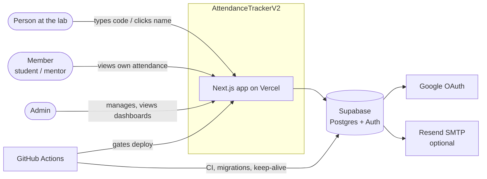
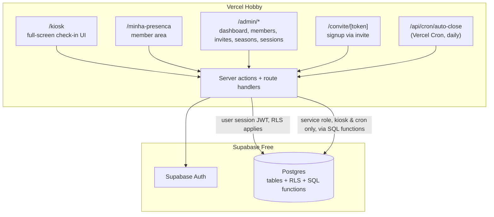
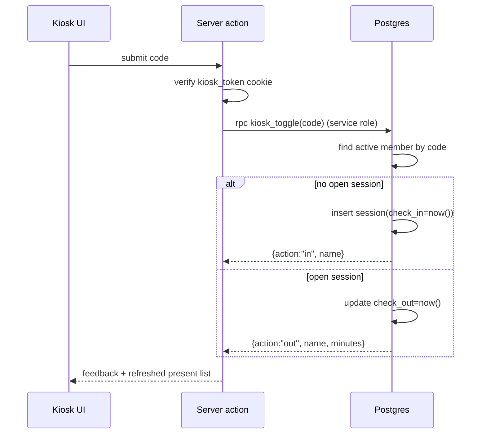
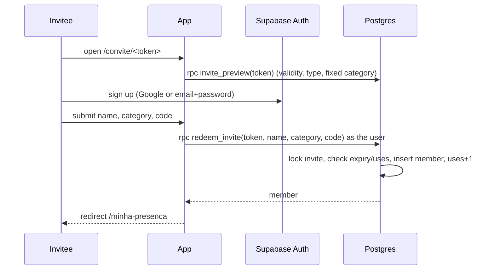

# Architecture overview

## System context (C4 level 1)



## Containers (C4 level 2)



## Route map

| Route | Who | Notes |
|---|---|---|
| `/kiosk` | Kiosk device (cookie `kiosk_token`) | Code entry and the present-members grid. |
| `/kiosk/unlock` | Admin | Sets the kiosk cookie on the current device. |
| `/login` | Anyone | Google or email + password. |
| `/convite/[token]` | Invitee | Signup and profile (name, category, code). |
| `/minha-presenca` | Member | Own stats and sessions, correction requests. |
| `/admin` | Admin | Dashboard: 3 rankings, "Agora no lab". |
| `/admin/membros`, `/admin/membros/[id]` | Admin | Member management and detail. |
| `/admin/convites` | Admin | Create, copy and revoke invites. |
| `/admin/temporadas` | Admin | Seasons and phases per track. |
| `/admin/sessoes` | Admin | Pending, auto-closed and correction requests; edit sessions. |
| `/api/cron/auto-close` | Vercel Cron (`CRON_SECRET`) | Calls `close_stale_sessions()`. |
| `/api/health` | GitHub Actions | Keep-alive: runs a trivial DB query. |

## Code layout (planned)

```
src/
  app/                 # routes above (App Router)
  components/          # shared UI (shadcn/ui based)
  lib/
    supabase/          # server/browser/service clients (@supabase/ssr)
    attendance/        # pure TS math (expected hours, %, week ranges), unit-tested
    auth/              # requireAdmin(), requireMember(), kiosk token check
    validation/        # Zod schemas
  i18n/
    config.ts          # locales ['pt-BR','en'], default 'pt-BR'
    request.ts         # next-intl getRequestConfig: resolves the locale (member → cookie → Accept-Language → default)
messages/
  pt-BR.json           # source of truth for keys
  en.json
    database.types.ts  # generated
supabase/
  migrations/          # SQL migrations (the only way to change the schema)
  seed.sql             # local/staging demo data
  tests/               # pgTAP tests (RLS, RPCs)
tests/e2e/             # Playwright
```

## Internationalization

The UI uses next-intl with **no locale in the URL** ([ADR 0006](../adr/0006-i18n-next-intl.md)). The locale is resolved per request: `members.locale` → `locale` cookie → `Accept-Language` → `pt-BR`. A language switcher in the header updates the cookie, and the member's profile too when they're logged in. Server actions and SQL functions return error **codes** (e.g. `CODE_IN_USE`), which the UI translates.

## Key flows

### Kiosk check-in/out



### Invite redemption



More detail: [data-model.md](data-model.md), [auth-and-security.md](auth-and-security.md), [attendance-math.md](attendance-math.md), [ci-cd.md](ci-cd.md).
